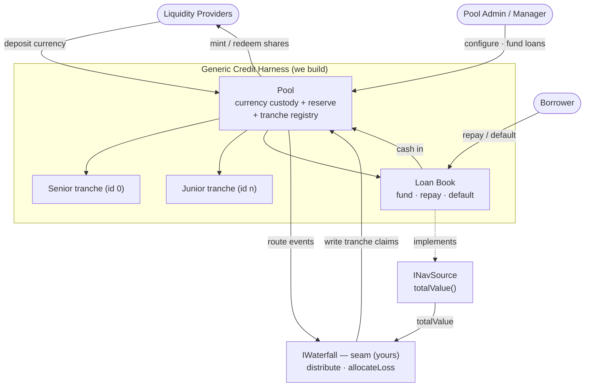
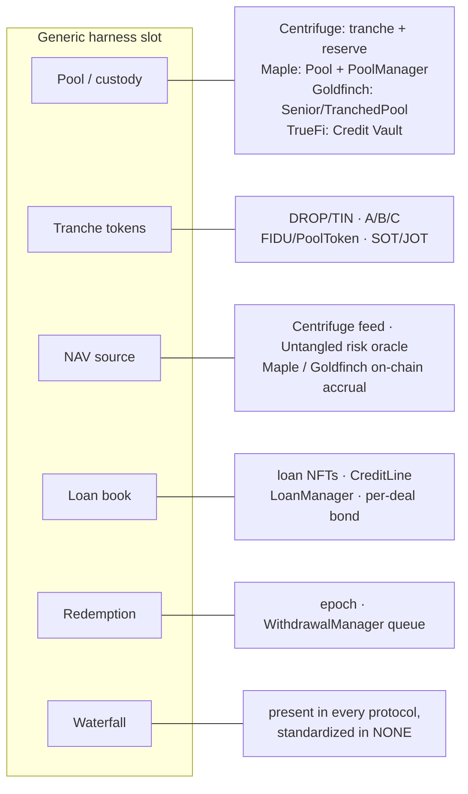
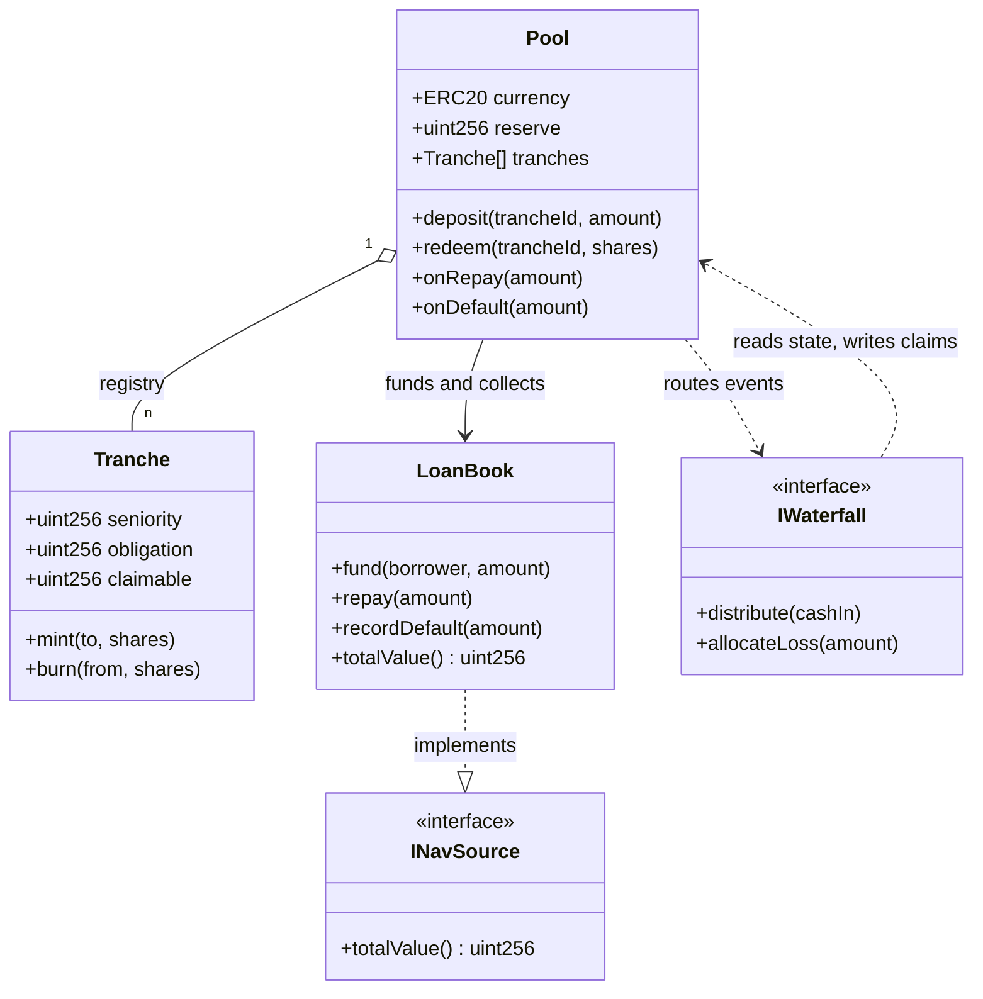
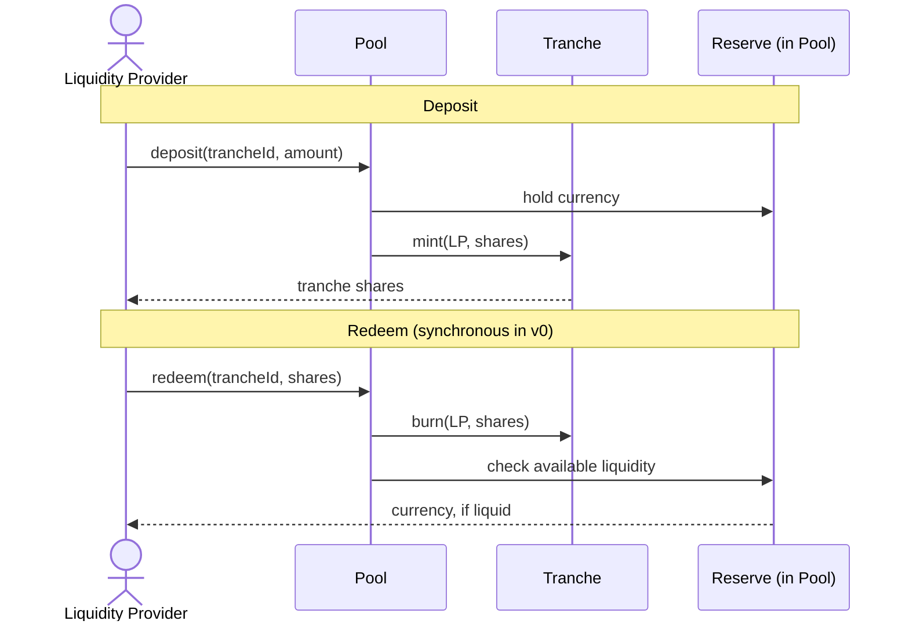
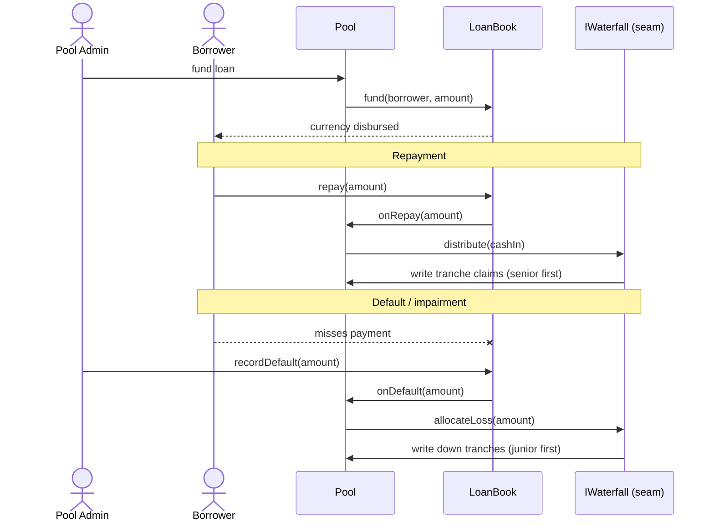
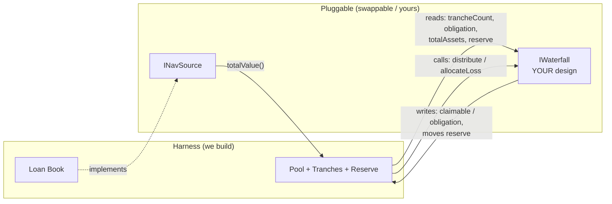

# Hooke-Centrifuge — Generic Credit Harness Architecture

This document specifies the **credit harness**: the smallest generic scaffold for a tranched private-credit pool, into which a waterfall engine is plugged. The harness is the work described here; the waterfall is treated as an external seam and is specified separately.

The design is the intersection of the leading on-chain private-credit protocols that use tranching, reduced to the components they all share. The governing principle is:

> The harness knows nothing about *why* value changes — not loans, not real-world assets, not yield. It knows only **currency in, currency out, and a single net-asset-value number.** Use-case-specific logic sits behind the NAV seam; the distribution and loss policy sits behind the waterfall seam.

Each diagram below is embedded as Mermaid and also rendered to SVG in [`./diagrams/`](./diagrams/) (validated with mermaid-cli).

## 1. Overview

The complete harness, with both seams shown. Rendered: [`diagrams/00-overview-generic.svg`](./diagrams/00-overview-generic.svg).

## 2. Prior-art synthesis

The component set is derived from the protocols surveyed. Each occupies the same generic slots; only the waterfall slot is universally present yet nowhere standardised. Rendered: [`diagrams/05-protocol-synthesis.svg`](./diagrams/05-protocol-synthesis.svg).

Two tranching styles appear: **pool-level** (Centrifuge, TrueFi, Maple — the pool is divided into tranches and a liquidity provider selects one) and **deal-level** (Goldfinch, Credix — the junior invests per deal and a senior portion is added from a joint pool by a leverage ratio). Pool-level is the more general base and is the target of this harness; deal-level is a specialisation that can be layered above it.

Sources: [Maple architecture](https://docs.maple.finance/technical-resources/protocol-overview/smart-contract-architecture), [Goldfinch — how the protocol works](https://dev.goldfinch.finance/docs/reference/how-the-protocol-works), [Untangled pool](https://docs.untangled.finance/docs/credio/Onchain-Private-Credit/Intro-Untangled-Pool/), [Credix docs](https://docs.credix.finance/), [TrueFi credit vaults](https://docs.truefi.io/faq/truefi-protocol/credit-vaults), and the in-repo study [`../code-study/centrifuge/`](../code-study/centrifuge/index.md).

## 3. Components

The fixed generic core (the harness). Rendered: [`diagrams/01-component-architecture.svg`](./diagrams/01-component-architecture.svg).

- **Currency** — one ERC-20 stablecoin (mock in the proof of concept). A single denomination; no swaps in the harness.
- **Pool** — sole custodian of the currency and the reserve, and the only contract liquidity providers interact with. Holds the **tranche registry**, an ordered list with index 0 the most senior. Exposes `deposit(trancheId, amount)` and `redeem(trancheId, shares)`, and the inbound hooks `onRepay`/`onDefault` that route to the waterfall.
- **Tranche** — per tranche: a share token and the canonical state (`obligation`, `claimable`, `seniority`). Generic over an arbitrary number of tranches.
- **Loan Book** — the credit assets, reduced to three verbs the harness understands: `fund(borrower, amount)`, `repay(amount)`, `recordDefault(amount)`. It implements `INavSource`.

## 4. Capital flow

Deposit and redemption. Redemption is synchronous from the reserve in the first version; production systems queue it (see Section 7). Rendered: [`diagrams/02-capital-flow.svg`](./diagrams/02-capital-flow.svg).

## 5. Loan lifecycle and the route to the waterfall

How fund, repay, and default events reach the waterfall seam. The harness owns the events; the waterfall owns the policy that decides the resulting tranche movements. Rendered: [`diagrams/03-loan-lifecycle.svg`](./diagrams/03-loan-lifecycle.svg).

## 6. The two seams

Both use-case-specific concerns are isolated behind interfaces, so they are swappable and the harness stays generic. Rendered: [`diagrams/04-seam-boundaries.svg`](./diagrams/04-seam-boundaries.svg).

**NAV source seam — `INavSource`.** A single `totalValue()` returning the value of the loan book. Centrifuge uses a feed, Untangled a risk oracle, Maple and Goldfinch on-chain accrual; all present the same boundary. In the proof of concept it is a settable mock.

**Waterfall seam — `IWaterfall` (specified separately).** The division of responsibility is: the **harness owns state and events**; the **waterfall owns the distribution, loss-allocation, and coverage policy** that mutates that state. The harness guarantees the waterfall the following:

- Reads: `trancheCount`, each tranche's `obligation`, `totalAssets()` (NAV + reserve), and `reserve`.
- Calls: `distribute(cashIn)` when currency arrives, `allocateLoss(amount)` when a default or impairment is recorded.
- Writes back: per-tranche `claimable`/`obligation`, and movement of the reserve.

The exact `IWaterfall` signature is left to the waterfall design and may reshape this boundary; the harness commits only to providing the reads above and routing the two events.

## 7. Minimal contract set and scope

Proof-of-concept contracts:

- `MockUSDC.sol` (or an OpenZeppelin ERC-20 from `lib/`)
- `Pool.sol` — custody, reserve, tranche registry, deposit/redeem, the inbound hooks
- `Tranche.sol` — share token and per-tranche state (or accounting within `Pool` for the first version)
- `LoanBook.sol` — `fund`/`repay`/`recordDefault`, implements `INavSource`
- `INavSource.sol`, `IWaterfall.sol` — the two seam interfaces

Deliberately stubbed, as they are not the subject of the proof of concept: identity/memberlist gating, real loan servicing and asset tokenisation, asynchronous redemption queues (synchronous from reserve in the first version), cross-chain messaging, factory and multi-pool deployment, and governance.

## 8. Relation to the standard

This harness is the concrete substrate from which the interface in [`../../spec/erc-waterfall-tranche.md`](../../spec/erc-waterfall-tranche.md) is intended to be distilled: the working `distribute`, `allocateLoss`, `coverageRatio`, and related members are to be lifted from the implemented waterfall and generalised, rather than designed in the abstract. See the direction recorded in [`../00-thesis-and-direction.md`](../00-thesis-and-direction.md).
